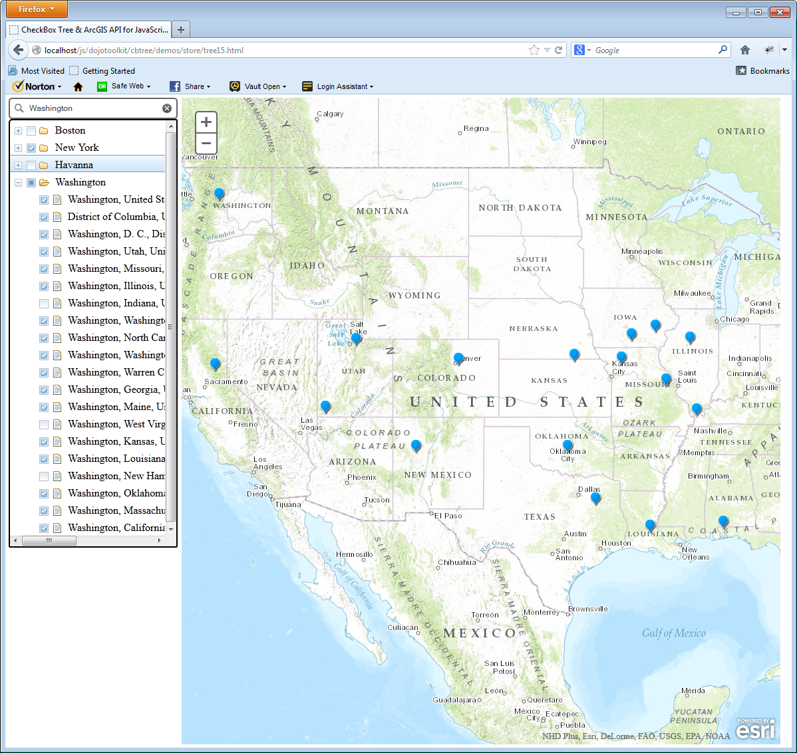

The CheckBox Tree examples, **_tree15.html_** and **_tree16.html_** utilize the
CheckBox Tree and the [ArcGIS 3.3 API for JavaScript](http://help.arcgis.com/en/webapi/javascript/arcgis/). 
Both examples are an extended version of the original ArcGIS 3.3 demo: [Locate points 
of interest](http://help.arcgis.com/en/webapi/javascript/arcgis/jssamples/#sample/locator_poi)

</img>

## Description

An ArcGIS Geocoder widget (search box) is display to the left of a map and the
search results are added to the tree below the search box. Clicking a checkbox
on the tree will, depending on the checkbox state, add or remove a marker for
the given location.

<span class="mega-octicon octicon-alert"></span>
**This tutorial is not an introduction to the [ArcGIS 3.3 API for JavaScript](http://help.arcgis.com/en/webapi/javascript/arcgis/), it is intended
to demonstrate how you can leverage the CheckBox Tree and some of its extensions
in your ArcGIS, or other, projects.**

### How it works
In addition to loading the ArcGIS 3.3 API for JavaScript, we must also load the
CheckBox Tree JavaScript modules and related css files. The second link below
loads the css file(s) for the dijit theme called *claro*.
The third link loads the *claro* theme css file(s) for the CheckBox Tree (notice
that the CheckBox Tree files are loaded locally).


```html
<link rel="stylesheet" href="http://serverapi.arcgisonline.com/jsapi/arcgis/3.3/js/esri/css/esri.css">
<link rel="stylesheet" href="http://serverapi.arcgisonline.com/jsapi/arcgis/3.3/js/dojo/dijit/themes/claro/claro.css">
<link rel="stylesheet" href="../../themes/claro/claro.css">
```
Next, we must tell the application the location of the **_cbtree_** package. This
must be done **BEFORE** loading the ArcGIS API simply because the ArcGIS API also
loads the dojo and dijit libraries.

```html
<script type="text/javascript">
  var dojoConfig = {
        packages: [
          { name: "cbtree",location: "/../../../" }
        ]
  };
</script>
<!-- Load the esri ArcGIS API 3.3 for JavaScript -->
<script type="text/javascript" src="http://serverapi.arcgisonline.com/jsapi/arcgis/3.3"></script>
```
After creating the esri objects like the *map*, *layer* and *geocoder*
we create an empty cbtree ObjectStore, ForestStoreModel and Tree.

```javascript
// Create an empty store, model and checkbox tree...
var store = new ObjectStore();
var model = new StoreModel({ store:store, query:{type:"parent"} });
var tree  = new Tree( {model:model, showRoot:false}, "tree" );
tree.startup();
```
Because the ObjectStore is empty you won't see the tree in your browser even 
though we call `tree.startup()`.

#### Geocoder Search Results
The Geocoder service uses a 'Best Match' search engine trying to return as many
possible matches, each match rated with a score. 
We can limit the Geocoder search area and the maximum number of locations
returned but that still doesn't mean the locations returned are an exact match.  
To make sure we populate our store only with exact matches we need to filter the
geocoder results by using the [cbtree/util/QueryEngine](Query-Engine)
module. In essence, the QueryEngine creates a filter function which we then can
apply to any set of objects.

```javascript
// Create geocoder results filter. (only exact matches)
filter = QueryEngine( {"feature.attributes.Score":100} );
```
The query object passed to the QueryEngine indicates we are only interested in
locations whose property *feature.attrubutes.Score* equals 100. We could further
restict eligible matches by adding additional filter criteria, for example:

```javascript
filter = QueryEngine( {"feature.attributes.Score":100, "feature.attributes.Addr_Type":"POI"} );
```
  
For additional information please refer to querying
[Nested Object Properties](Query-Engine#wiki-nested-object-properties).

#### Populating the ObjectStore
In order to populate the ObjectStore we must first capture the search results
returned by the Geocoder widget. To do this, an event handler is added to the
Geocoder widget which will be listening for events of type **_findResults_**.

```javascript
// Add event listener to geocoder.
geocoder.on( "findResults", function(response) {
  // First, filter the locations (exact matches only).
  var data = filter(response.results)
  var name = response.value.replace(/(^|\W)([a-z])/g, function($0){ return $0.toUpperCase(); });
  var id   = name.toLowerCase();

  if (data.length) {
    // First create a parent record, with a specific id....
    store.add( {id:id, name: name, type:"parent", feature:{attributes:{Address_Type:"POI"}}}); 
    data.forEach( function(location) {
      location.feature.attributes.name = location.name;
      location.feature.setSymbol(symbol);
      location.feature.setInfoTemplate(template);
      location.parent = id;
      location.type   = "child";
      
      store.add( location );  // Add location to the store....
    });
    domStyle.set("tree", { borderStyle:"solid"});
  } else {
    alert("No match found for: "+ response.value);
  }
});
```
Each time a search string is entered the Geocoder widget will fire a **_findResults_**
event and the search results are passed to the event handler as the **_response_**
argument. For each search result a "parent" record is created in the store and
the actual location records are added to the store as children of the parent
record.
The parent record does not represent an actual geo location, it merely ancors
the results in the store establishing a hierarchy.

<span class="octicon octicon-alert"></span>
Note that only the parent record gets a specific id assigned, this because the
id of store records must be unique. In this application we can't use the name as
the id for location records simply because it's very likely we get many duplicates.
Instead we'll have the store generate unique id's for all child (location) records.

Because the ForestStoreModel is automatically notified of any changes to the
store, it starts updating the CheckBox Tree which will now be visible in the
browser.

#### Tree Checkboxes
Even though the ObjectStore is now loaded with location information and our tree
is visible we still don't see any location markers on the map.
The location markers are added, or removed, when clicking the checkboxes on our
tree. To enable this functionality we need to add an event handler to the tree
which will capture events of type **_checkBoxClick_**.

```javascript
// Add event listener to the tree
tree.on( "checkBoxClick", function( item, node, evt ) {
  function setFeatures(item) {
    if (item.type == "child") {
      if(model.getChecked(item)) {
        layer.add(item.feature);
      } else {
        layer.remove(item.feature);
      }
    }
  }
  when( store.getChildren(item), function (children) {
    children.forEach( setFeatures );
  });
  setFeatures(item);
});
```
The checkBoxClick event handler above is called each time a checkbox on the tree
is clicked and, depending on the current checked state of the checkbox, a location 
marker is added to, or removed from, the map. The implementation of the event
handler above uses the ForestStoreModel and associated ObjectStore to fetch the
children and their checked state. 

However, we could have implemented the same functionality using the DOM instead
as show below:

```javascript
// Add event listener to the tree
tree.on( "checkBoxClick", function( item, node, evt ) {
  function setFeatures(node) {
    if (node.item.type == "child") {
      if(node.get("checked")) {
        layer.add(node.item.feature);
      } else {
        layer.remove(node.item.feature);
      }
    }
  }
  node.getChildren().forEach( setFeatures );
  setFeatures(node);
});
```
### Alternative Approach
The example discussed here (`tree15.html`) processes the Geocoder responses as part
of the Geocoder event handler, adding individual parent and child records to the
ObjectStore. Example `tree16.html` however, accomplishes the same result using
a custom data handler that is associated with the ObjectStore.
Instead of dissecting the search results as part of the Geocoder event handler,
the search result is loaded directly into the store which will then run it by
the custom data handler before populating the store.

```javascript
// Add event listener to geocoder.
geocoder.on( "findResults", function(response) {
  var store = new Hierarchy( { data: response, handleAs:"geocoder", 
                               dataHandler: {
                                 handler: arcGisHandler,
                                 options: { template: template, symbol: symbol }
                               } 
                             });
            ...
});
```
See [Data Handlers](Data-Handlers) for a detailed description on how to utilize 
and create your own data handlers.

### Want More?
Consider using the [Tree Styling](Tree-Styling) extension to apply custom icons
to your tree. For example, you could simply map the address type of a location
to a specific set of icons. After loading the Tree Styling extension `cbtree/extensions/TreeStyling`
you would create your tree as follows:

```javascript
var valueMap = {"feature.attributes.Addr_Type": {}};
var tree = new Tree( {model:model, showRoot:false, valueToIconMap: valueMap}, "tree" );
```
See the [Item Property Mapping](Tree-Styling#wiki-item-property-mapping) section
for a detailed description of how to map item properties to icons.

## Code
The  full code listed below can be found at **cbtree/demos/store/tree15.html**

```html
<!DOCTYPE html>
<html>
  <head>
    <meta http-equiv="Content-Type" content="text/html; charset=utf-8">
    <meta http-equiv="X-UA-Compatible" content="IE=7,IE=9" />
    <meta name="viewport" content="initial-scale=1, maximum-scale=1,user-scalable=no"/>
    <title>CheckBox Tree &amp; ArcGIS API for JavaScript | Place Finding</title>
    <link rel="stylesheet" href="http://serverapi.arcgisonline.com/jsapi/arcgis/3.3/js/esri/css/esri.css">
    <link rel="stylesheet" href="http://serverapi.arcgisonline.com/jsapi/arcgis/3.3/js/dojo/dijit/themes/claro/claro.css">
    <link rel="stylesheet" href="../../themes/claro/claro.css">

    <style>
      html, body, #container { height:99%; width:100%; margin:0; padding:0; }
      #location {  padding: 5px 0 0 5px; height:99%; width: 260px; float:left; }
      #map { height:99%; width: 900px; position: absolute;  top: 5px;  left: 265px; }
      #tree {  width: 250px;  float: left; border-width:  2px; border-radius: 5px; border-style:"none"}
      #search { display: block;}
      .simpleGeocoder .esriGeocoderContainer { width: 250px; }
    </style>

    <script type="text/javascript">
      var dojoConfig = {
            packages: [
              { name: "cbtree",location: "/../../../" }
            ]
      };
    </script>

    <script type="text/javascript" src="http://serverapi.arcgisonline.com/jsapi/arcgis/3.3"></script>
    <script type="text/javascript">
      require(["dojo/ready",
               "dojo/dom-style",
               "esri/dijit/Popup",
               "cbtree/Tree",
               "cbtree/store/ObjectStore", 
               "cbtree/model/ForestStoreModel",
               "cbtree/util/QueryEngine",
               "esri/dijit/Geocoder",
               "esri/map"
              ], function (ready, domStyle, Popup, Tree, ObjectStore, StoreModel, QueryEngine) {

        var popup, map, geocoder, layer, template, symbol;
        var store, model, tree, filter;
        
        ready(function() {
          // create the map
          popup = new Popup(null, dojo.create("div"));
          map = new esri.Map("map",{
            basemap: "topo",
            center: [ -100, 37 ], // long, lat
            zoom: 5,
            infoWindow: popup
          });

          // add a graphics layer for geocoding results
          layer = map.addLayer(new esri.layers.GraphicsLayer({
            id: "results"
          }));

          // create the geocoder
          geocoder = new esri.dijit.Geocoder({ 
            autoNavigate: false, // do not zoom to best result
            maxLocations: 20, // increase number of results returned
            map: map,
            arcgisGeocoder: {
              url: "http://geocode.arcgis.com/arcgis/rest/services/World/GeocodeServer",
              name: "Esri World Geocoder",
              placeholder: "Find a place",
              sourceCountry: "USA" // limit search to the United States
            }
          }, "search");
          geocoder.startup();
          geocoder.focus();

          // Create store, model and checkbox tree...
          store  = new ObjectStore();
          model  = new StoreModel({ store:store, query:{type:"parent"} });
          tree   = new Tree( {model:model, showRoot:false, persist:false}, "tree" );
          tree.startup();

          // Create geocoder results filter. (only exact matches)
          filter = QueryEngine( {"feature.attributes.Score":100} );

          symbol = new esri.symbol.PictureMarkerSymbol({
            "angle":0,
            "xoffset":0,
            "yoffset":10,
            "type":"esriPMS",
            "url":"http://static.arcgis.com/images/Symbols/Shapes/BluePin1LargeB.png",
            "contentType":"image/png",
            "width":24,
            "height":24
          });
          template = new esri.InfoTemplate("${name}", "${*}");

          // Add event listener to geocoder.
          geocoder.on( "findResults", function(response) {
            // First, filter the locations (exact matches only).
            var data = filter(response.results)
            var name = response.value.replace(/(^|\W)([a-z])/g, function($0){ return $0.toUpperCase(); });
            var id   = name.toLowerCase();

            if (data.length) {
              // First create a parent record, with a specific id....
              store.add( {id:id, name: name, type:"parent", feature:{attributes:{Address_Type:"POI"}}}); 
              data.forEach( function(location) {
                location.feature.attributes.name = location.name;
                location.feature.setSymbol(symbol);
                location.feature.setInfoTemplate(template);
                location.parent = id;
                location.type   = "child";
                
                store.add( location );  // Add location to the store....
              });
              domStyle.set("tree", { borderStyle:"solid"});
            } else {
              alert("No match found for: "+ response.value);
            }
          });

          // Add event listener to the tree
          tree.on( "checkBoxClick", function( item, node, evt ) {
            function setFeatures(item) {
              if (item.type == "child") {
                if(model.getChecked(item)) {
                  layer.add(item.feature);
                } else {
                  layer.remove(item.feature);
                }
              }
            }
            store.getChildren(item).forEach( setFeatures );
            setFeatures(item);
          });
        });
    });
    </script>
  </head>
  <body class="claro">
    <div id="container">
      <div id="location">
        <div id="search"></div>
        <div id="tree"></div>
      </div>
      <div id="map"></div>
    </div>
  </body>
</html>
```