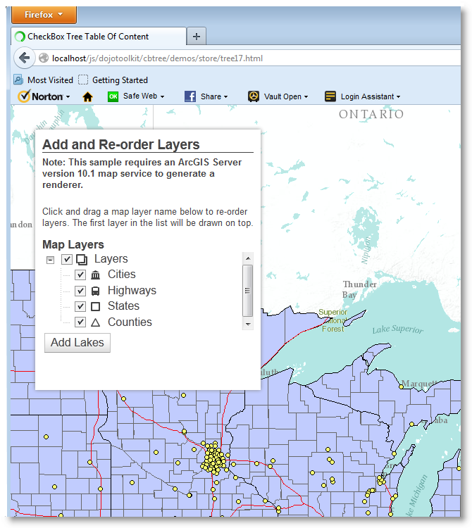
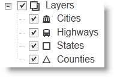

The CheckBox Tree example, **_tree17.html_** utilize the CheckBox Tree and the 
[ArcGIS 3.3 API for JavaScript](http://help.arcgis.com/en/webapi/javascript/arcgis/). 
This example is an extended version of the original ArcGIS 3.3 demo: [Reorder layers in map service](http://help.arcgis.com/en/webapi/javascript/arcgis/jssamples/#sample/layers_dynamic_reorder)

This example uses some of the key CheckBox Tree features and extensions such as
Drag-n-Drop, custom icons and property value to icon mapping (TreeStyling).
To create a coherent gray scale Table-Of-Content (TOC) the dijit theme
*Tundra* is used in this instance. In addition, tips and samples are provided on
how to leverages other cbtree extensions such as *QueryEngine* and *Ancestry*.

</img>

## Description

The [ArcGIS Map System](http://www.esri.com/software/arcgis) is a popular toolkit
to incorporate maps in web applications. In general, maps are orginized in 
layers. This demo draws a map using the ArcGIS API and adds the different
layer to the Table-Of-Content (TOC) which then can be enabled or disabled by
clicking the associated checkbox. In additon, each layer name in the TOC is
mapped to a custom icon.

For this particular demo we use a small subset of the open source project 
[MAKI ICONS](http://mapbox.com/maki/) by MapBox. However, you can use your own
icons instead if you like.

<span class="mega-icon mega-icon-exclamation"></span>
**This tutorial is not an introduction to the [ArcGIS 3.3 API for JavaScript](http://help.arcgis.com/en/webapi/javascript/arcgis/), it is intended
to demonstrate how you can leverage the CheckBox Tree and some of its extensions
in your ArcGIS, or other, projects.**

### How it works
In addition to loading the ArcGIS 3.3 API for JavaScript, we must also load the
CheckBox Tree modules and related css files. The second link below loads the css
file(s) for the dijit theme called *Tundra*. The third link loads the *Tundra* 
theme css file(s) for the CheckBox Tree and the fourth loads the custom *MAKI*
icon definitions, more on these icons later. (notice that the CheckBox Tree and
Maki files are loaded locally).


```html
<link rel="stylesheet" href="http://serverapi.arcgisonline.com/jsapi/arcgis/3.3/js/esri/css/esri.css">
<link rel="stylesheet" href="http://serverapi.arcgisonline.com/jsapi/arcgis/3.3/js/dojo/dijit/themes/tundra/tundra.css">
<link rel="stylesheet" href="../../themes/tundra/tundra.css">
<link rel="stylesheet" href="../../icons/maki.css">
```
Next, we must tell the application the location of the **_cbtree_** package. This
must be done **BEFORE** loading the ArcGIS API simply because the ArcGIS API also
loads the dojo and dijit libraries.

```html
<script type="text/javascript">
  var dojoConfig = {
        packages: [
          { name: "cbtree",location: "/../../../" }
        ]
  };
</script>
<!-- Load the esri ArcGIS API 3.3 for JavaScript -->
<script type="text/javascript" src="http://serverapi.arcgisonline.com/jsapi/arcgis/3.3"></script>
```

#### Building the TOC

The Table-Of-Content is, like any other CheckBox Tree, a combination of a store,
model and a CheckBox Tree. An important aspect of the TOC is the fact that it
will be populated dynamically, that is, at first the store is empty and entries
(layers) are added when they become available. Therefore we need to use a store
that:

1. Supports data hierarchy and,
2. Emit events when the content changes.
 
The cbtree [ObjectStore](Store#wiki-the-object-store) provides all that we need.
To organize the map layers in a hierarchical structure we start with a TOC entry
named *Layers* which will serve as the parent of all layers we will be adding
later.

```javascript
function buildTOC (location) {
  var index = [  { id:"layers", name:"Layers", type:"TOC"}  ];

  store = new ObjectStore({data: index});
  model = new ForestStoreModel( {store: store, query:{type:"TOC"} });
  // Create the checkbox tree adding DnD support and value to icon mapping.
  tree  = new Tree( { model: model, 
                      dndController: dndSource,
                      betweenThreshold: 5,
                      valueToIconMap: { name: {"*":"* maki"} },
                      autoExpand: true,
                      showRoot:false
                     },
                     location);
  tree.startup();
}
```
To add Drag-n-Drop (DnD) support, to allow for layers to be reordered, two specific
CheckBox Tree properties are set:
```javascript
dndController: dndSource,
betweenThreshold: 5,
```
The *valueToIconMap* property is explained later in the document.

#### Populating the ObjectStore
In order to populate the ObjectStore we must capture the layer information made
available after the map and layers are loaded from the esri server. To do this,
an event handler is added to the layer object which will be listening for events
of type **_updateEnd_**.

```javascript
var urlDyn   = "http://sampleserver6.arcgisonline.com/arcgis/rest/services/USA/MapServer";
var usaLayer = new esri.layers.ArcGISDynamicMapServiceLayer(urlDyn, { "id": "usa" });

on (usaLayer, "updateEnd", function() {
  // Add any new layers to the TOC
  storeLayers( usaLayer );
});
```
Technically, the `usaLayer` object does not emit events instead it uses callbacks.
The local `on()` function gives you the same look and feel as `dojo/on`, taking
the event name and adding *after advice* to the objects `onUpdateEnd()` method.
For more details on events and callbacks please refer to the [Working with Events](CheckBox-Tree-Usage#wiki-working-with-events) section.

```javascript
function storeLayers(layerInfos) {
  // Layers have been loaded, hide the loading icon add any new layers
  // to the store.
  dojo.style(dojo.byId("loading"), "display", "none");
  if (!layerInfos.hasOwnProperty("dynamicLayerInfos")) {
    var dynLayerInfos = map.getLayer("usa").createDynamicLayerInfosFromLayerInfos();
  } else {
    var dynLayerInfos = layerInfos.dynamicLayerInfos
  }
  dynLayerInfos.forEach( function (layerInfo) {
    var layerName = layerInfo.name.split(".").pop();
    var storeId   = "layer_" + layerName;

    if (!store.get(storeId)) {
      var layerRec = { id: storeId, name: layerName, type: "layerInfo", 
                        checked: layerInfo.defaultVisibility,
                        info: layerInfo };
      // Add record to the store
      store.put( layerRec, { parent: "layers"} );
    }
  },this);
}
```
For each new layer a record is added to the store with its *type* property set
to **_layerInfo_** and the *info* property holds a reference to the actual dynamic
layer object. When the record is inserted we also say that the store object
with id **_layers_** will be the parent object making this record a child.

Because the ForestStoreModel is automatically notified of any changes to the
ObjectStore, it starts updating the CheckBox Tree accordingly and on completion
the TOC should look like:

</img>

Whenever you click any of the checkboxes the associated map layer is, depending
on the new checkbox state, either shown or hidden. To enable this functionality
we need to add an event handler to the tree which will capture events of type 
**_checkBoxClick_**.

```javascript
function layerClicked (item, treeNode, event ) {
	// A checkbox was clicked, get all layers from the store whose checked
	// state is 'true' and update layer visibility.
	var layers   = store.query( {type:"layerInfo", checked:true} );
	var layerIds = layers.map( function(layer) {
		return layer.info.id; 
	});
	map.getLayer("usa").setVisibleLayers(layerIds.length ? layerIds : [-1]);
}

tree.on("checkBoxClick", layerClicked);

```
To change a layers visibility we must pass the `setVisibleLayers()` function 
an array of **_all_** layer Ids that will be visible. Therefore, instead of 
focusing on the specific checkbox that was clicked, we simply query the store
for all objects of type **_layerInfo_** with their current checked state set to
`true`.

#### Changing the layer order
The layer order determines how the layers are stacked on the canvas. The layer
first in the list is always drawn on top. You can change the layer order as follows:
Click a layer and drag it to a new location in the TOC. The CheckBox Tree
configuration in this particular demo gives you two options:

1. Drop the layer in between two other layers or,
2. Drop the layer on top of another layer.

If you drop a layer on top of another layer it will become a child of the layer
you dropped it on. Please note this does **_not_** mean it comes a sublayer in
the context of the map. It merely allows you to group layers in a parent-child
fashion.

To track Drag-n-Drop movement of layers within the TOC an event handler is
established with the model which listens for **_pasteItem_** events:

```javascript
function reorderLayers(item, insertIndex, before) {
  // Layer was dragged to a new location.

  function getLayers(parent, layers) {
    // Get all the children with type 'layerInfo' for the parent
    var children = store.getChildren(parent);
    var layers   = layers || [];

    children.forEach( function (child) {
      getLayers(child, layers);
    });
    if (parent.type == "layerInfo") {
      layers.push( parent.info );
    }
    return layers;
  }
  
  switch (item.type) {
    case "layerInfo":
      var layers = getLayers( store.get("layers") );            
      if (layers && layers.length) {
        map.getLayer("usa").setDynamicLayerInfos(layers);
      }
      break;
  }
}

model.on("pasteItem", reorderLayers );
```
Whenever an item is pasted onto the TOC, (e.g. the mouse button is released after
the drag operation), the `reorderLayers()` function is called. At this point the
model has already told the store to re-insert the dragged item at the new location.

The `reorderLayers()` function collects all records with type *layerInfo* in the
order they appear in the store hierarchy starting from the top.

#### Using Additional Extensions
Although pretty efficient, the `reorderLayers()` function listed above could be
simplified if we would use the cbtree *QueryEngine* and the store extension
*Ancestry*. In order to do so we would need to load the two extra modules with
the others:

```javascript
require([          ...
          "cbtree/util/QueryEngine",
          "cbtree/store/extensions/Ancestry"
        ], function ( ... , QueryEngine, Ancestry ) {
  // First, create a query function.
  var queryFunction = QueryEngine( {type:"layerInfo"} );  
                  ...
  function reorderLayers(item, insertIndex, before) {
    // Layer was dragged to a new location.
    switch (item.type) {
      case "layerInfo":
        // Get all descendants of "layers" whose type is "layerInfo".
        var records = queryFunction( store.getDescendants("layers") );
        if (records && records.length) {
          var layers = records.map( function(record) {
            return record.info; 
          });
          map.getLayer("usa").setDynamicLayerInfos(layers);
        }
        break;
    }
  }
                  ...   
});
```
In this implementation we simply create a [query function](Query-Engine#wiki-the-query-function)
once that will return all records whose type property is set to *layerInfo*.
The [Ancestry](Ancestry-Extension) extension offers the ability to get all
[descendants](Ancestry-Extension#wiki-getdescendants) of any object in a 
hierarchical store. Combining the two eliminates the need for the `getLayers()`
function in the original implementation.

To get all the desired records in the correct order we can simply write:
```javascript
var records = queryFunction( store.getDescendants("layers") );
```
Give it a try...

#### Map Table-Of-Content to icons
The CheckBox Tree and [Tree Styling](Tree-Styling) extension located at
`cbtree/extensions/TreeStyling` offer several ways to assign custom icons to
tree nodes. This particular demo uses the *'Value To Icon'* method which allows
you to map property value(s) to specific icons.


To map a property value to an icon, or better yet a css classname, you need three
things:

1. An image sprite (collection of images).
2. A css definition file for the images and,
3. Mapping rules.

For this demo we use the css file maki.css located at `cbtree/icons/maki.css`
which in turn loads the image sprite `cbtree/icons/images/maki.png`. The image
sprite is a single image containing 6 icons, each 18x18 pixels, as shown below:

</img>

When creating the CheckBox Tree we set the [valueToIconMap](Tree-Styling#wiki-valuetoiconmap)
property, which is part of the TreeStyling extension, as follows:

```javascript
valueToIconMap: { name: {"*":"* maki"} }
```
What the above mapping rule does is, it replaces the wildcard character (\*) 
with the value of the store item property *name*, creating the css classname
for the tree node icon. 
For example, if a store item has its *name* property set to *Highways* the
rule transforms in real-time to `{name: {"Highways":"Highways maki"}}` resulting 
in the css classname `'Highways maki'`.

Given the above mapping rule we can now define the css rule sets for the image
sprite:

```css
.maki {
	background-image: url('images/maki.png');
	background-repeat: no-repeat;
	width: 18px; height: 18px;
	margin: 0; padding: 0;
}
.maki.Layers { background-position: -0px;}
.maki.Cities { background-position: -18px;}
.maki.Highways { background-position: -36px; }
.maki.States {background-position: -54px;}
.maki.Counties {background-position: -72px;}
.maki.Lakes {background-position: -90px;}
```


## Code
The  full code listed below can be found at **cbtree/demos/store/tree17.html**

```html
<!doctype html>
<html>
  <head>
    <meta charset="utf-8">
    <meta http-equiv="X-UA-Compatible" content="IE=7,IE=9">
    <meta name="viewport" content="initial-scale=1, maximum-scale=1,user-scalable=no">
    <title>CheckBox Tree Table Of Content</title>

    <link rel="stylesheet" href="http://serverapi.arcgisonline.com/jsapi/arcgis/3.3/js/dojo/dijit/themes/tundra/tundra.css">
    <link rel="stylesheet" href="http://serverapi.arcgisonline.com/jsapi/arcgis/3.3/js/esri/css/esri.css">
    <link rel="stylesheet" href="../../themes/tundra/tundra.css">
    <link rel="stylesheet" href="../../icons/maki.css">

    <style>
      html, body { height: 100%; width: 100%; margin: 0; padding: 0; }
      h3 { margin: 0 0 5px 0; border-bottom: 1px solid #444; }
      .shadow {
        -moz-box-shadow: 0 0 5px #888;
        -webkit-box-shadow: 0 0 5px #888;
        box-shadow: 0 0 5px #888;
      }
      #map{ margin: 0; padding: 0; }
      #feedback {
        background: #fff;
        color: #444;
        font-family: arial;
        height: 350px;
        left: 30px;
        margin: 5px;
        padding: 10px;
        position: absolute;
        top: 30px;
        width: 300px;
        z-index: 40;
      }
      #note, #hint { font-size: 80%; }
      #note { font-weight: 700; padding: 0 0 10px 0; }
      #layerList {
        width: 300px;
      }
    </style>

    <script type="text/javascript">
      var dojoConfig = {
            parseOnLoad: true,
            packages: [
              { name: "cbtree",location: "/../../../" }
            ]
      };
    </script>

    <!-- Note: Not all ArcGIS 3.3 modules are AMD compliant... -->
    <script src="http://serverapi.arcgisonline.com/jsapi/arcgis/3.3/"></script>
    <script>
      // Load non-AMD modules
      dojo.require("esri.map");

      require(["dijit/layout/BorderContainer", 
               "dijit/layout/ContentPane",
               "dijit/form/Button"]);

      require(["dojo/aspect",                   // aspect.after()
               "dojo/ready",                    // ready()
               "dijit/tree/dndSource",
               "esri/dijit/Popup",
               "cbtree/Tree",
               "cbtree/extensions/TreeStyling",
               "cbtree/model/ForestStoreModel",
               "cbtree/store/ObjectStore"
              ], function (aspect, ready, dndSource, Popup, Tree, TreeStyling, 
                            ForestStoreModel, ObjectStore) {

      var map, store, model, tree;

      function on (target, event, listener) {
        // Mimic dojo/on for non-emitters like esri.layers
        aspect.after( target, event, listener, true );
      }

      function buildTOC (location) {
        var index = [  { id:"layers", name:"Layers", type:"TOC"}  ];

        store = new ObjectStore({data: index});
        model = new ForestStoreModel( {store: store, query:{type:"TOC"} });
        // Create the checkbox tree adding DnD support and value to icon mapping.
        tree  = new Tree( { model: model, 
                            dndController: dndSource,
                            betweenThreshold: 5,
                            valueToIconMap: { name: {"*":"* maki"} },
                            autoExpand: true,
                            showRoot:false
                           },
                           location);
        tree.startup();
      }

      function layerClicked (item, treeNode, event ) {
        // A checkbox was clicked, get all layers from the store whose checked
        // state is 'true' and update layer visibility.
        var layers   = store.query( {type:"layerInfo", checked:true} );
        var layerIds = layers.map( function(layer) {
          return layer.info.id; 
        });
        map.getLayer("usa").setVisibleLayers(layerIds.length ? layerIds : [-1]);
      }

      function storeLayers(layerInfos) {
        // Layers have been loaded, hide the loading icon add any new layers
        // to the store.
        dojo.style(dojo.byId("loading"), "display", "none");
        if (!layerInfos.hasOwnProperty("dynamicLayerInfos")) {
          var dynLayerInfos = map.getLayer("usa").createDynamicLayerInfosFromLayerInfos();
        } else {
          var dynLayerInfos = layerInfos.dynamicLayerInfos
        }
        dynLayerInfos.forEach( function (layerInfo) {
          var layerName = layerInfo.name.split(".").pop();
          var storeId   = "layer_" + layerName;

          if (!store.get(storeId)) {
            var layerRec = { id: storeId, name: layerName, type: "layerInfo", 
                              checked: layerInfo.defaultVisibility,
                              info: layerInfo };
            // Add record to the store
            store.put( layerRec, { parent: "layers"} );
          }
        },this);
      }

      function reorderLayers(item, insertIndex, before) {
        // Layer was dragged to a new location.

        function getLayers(parent, layers) {
          // Get all the children with type 'layerInfo' for the parent
          var children = store.getChildren(parent);
          var layers   = layers || [];

          children.forEach( function (child) {
            getLayers(child, layers);
          });
          if (parent.type == "layerInfo") {
            layers.push( parent.info );
          }
          return layers;
        }
        
        switch (item.type) {
          case "layerInfo":
            var layers = getLayers( store.get("layers") );            
            if (layers && layers.length) {
              map.getLayer("usa").setDynamicLayerInfos(layers);
            }
            break;
        }
      }

      function addLakes() {
        var layerName, dataSource, layerSource, options, drawingOptions, dynamicLayerInfo;

        // disable the "Add Lakes" button
        dijit.byId("lakes").set("disabled", true);

        // show a loading icon
        dojo.style(dojo.byId("loading"), "visibility", "visible");

        // layer name in the workspace
        layerName = "ss6.gdb.Lakes";
        // get existing layer info from the store. The  akes info will be appeneded
        // to this object so it shows up in the map service image
        var layers = store.query( {type:"layerInfo"} );
        var dynLayerInfos = layers.map( function (layer) { return layer.info;});

        // create a new dynamic layer info object for the lakes layer
        dynamicLayerInfo      = new esri.layers.DynamicLayerInfo();
        dynamicLayerInfo.id   = layers.total;
        dynamicLayerInfo.name = layerName;
        // can also set things like min/max scale to specify scale
        // dependency on the new dynamic layer

        // create a table data source to access the lakes layer
        dataSource = new esri.layers.TableDataSource();
        dataSource.workspaceId = "MyDatabaseWorkspaceIDSSR2"; // not exposed via REST, sad face :(
        dataSource.dataSourceName = layerName;
        // and now a layer source
        layerSource = new esri.layers.LayerDataSource();
        layerSource.dataSource = dataSource;
        dynamicLayerInfo.source = layerSource;

        dynLayerInfos.push( dynamicLayerInfo );
        // set new infos, but don't refresh, map will be updated when the
        // drawing options are set
        map.getLayer("usa").setDynamicLayerInfos( dynLayerInfos, true);

        options = [];
        drawingOptions = new esri.layers.LayerDrawingOptions();
        drawingOptions.renderer = new esri.renderer.SimpleRenderer(
          new esri.symbol.SimpleFillSymbol(
            "solid",
            null,
            new dojo.Color([255, 0, 255, 0.75]) // fuschia lakes!
          )
        );
        options[4] = drawingOptions;

        map.getLayer("usa").setLayerDrawingOptions(options);
      }

      function init() {
        var urlBase = "http://services.arcgisonline.com/ArcGIS/rest/services/World_Terrain_Base/MapServer";
        var urlRef  = "http://services.arcgisonline.com/ArcGIS/rest/services/Reference/World_Reference_Overlay/MapServer";
        var urlDyn  = "http://sampleserver6.arcgisonline.com/arcgis/rest/services/USA/MapServer";
        var popup   = Popup(null, dojo.create("div"));

        map = new esri.Map("map", { 
          center: [-86.636, 44.882],
          zoom: 6,
          infoWindow: popup,
          slider: false
        });

        var basemap  = new esri.layers.ArcGISTiledMapServiceLayer(urlBase);
        var refLayer = new esri.layers.ArcGISTiledMapServiceLayer(urlRef);
        var usaLayer = new esri.layers.ArcGISDynamicMapServiceLayer(urlDyn, { "id": "usa" });

        map.addLayer(basemap);
        map.addLayer(refLayer);
        map.addLayer(usaLayer);

        // Create TOC store, model and tree.
        buildTOC("layerList");

        // build the layer list
        if ( usaLayer.loaded ) {
          storeLayers( map.getLayer("usa") );
        }

        // Establish event listeners.
        on (usaLayer, "onUpdateEnd", function() {
          // rebuild the layer list
          storeLayers( map.getLayer("usa") );
        });

        // add the lakes layer to the existing map service
        on (dijit.byId("lakes"), "onClick", addLakes);

        tree.on("checkBoxClick", layerClicked);
        model.on("pasteItem", reorderLayers );
      }

      // Let's get started when dojo is ready...
      ready (init);

    });
    </script>
  </head>

  <body class="tundra">
    <div data-dojo-type="dijit/layout/BorderContainer"
         data-dojo-props="design:'headline',gutters:false"
         style="width: 100%; height: 100%; margin: 0;">
      <div id="map"
           data-dojo-type="dijit/layout/ContentPane"
           data-dojo-props="region:'center'">

        <div id="feedback" class="shadow">
          <h3>Add and Re-order Layers</h3>
          <div id="info">
            <div id="note">
              Note:  This sample requires an ArcGIS Server version 10.1 map service
              to generate a renderer.
            </div>
            
            <p id="hint">
              Click and drag a map layer name below to re-order layers. The first
              layer in the list will be drawn on top.
            </p>

            <strong>Map Layers</strong>
            
            <br />
            <div id="layerList"></div>

            <button id="lakes"
                    data-dojo-type="dijit.form.Button">
              Add Lakes
            </button>
            
          </div>
        </div>
      </div>
    </div>
  </body>
</html>
```
