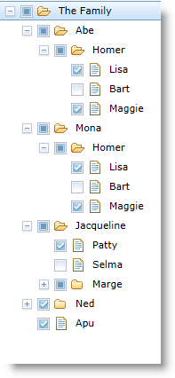

The CheckBox Tree is an extension of the standard dijit tree, therefore all
features available with the dijit tree are also offered by the CheckBox Tree
with the exception of dijit Tree V1.0 backward compatibility, that is, you must
provide the **_model_** argument when creating the tree.
This document describes the CheckBox Tree extensions only. Details on the
standard dijit tree can be found
[here](http://dojotoolkit.org/reference-guide/1.7/dijit/Tree.html).

<h3>Content <span class="mega-octicon octicon-book"></span></h3>

* [CheckBox Tree Basics](#checkbox-tree-basics)
* [CheckBox Tree Placement](#checkbox-tree-placement)
* [CheckBox Tree Expand and Collapse](#checkbox-tree-expand-and-collapse)
* [CheckBox Tree Advanced](#checkbox-tree-advanced)
* [Sample Application](#sample-application)

<h2 id="checkbox-tree-basics">CheckBox Tree Basics</h2>

### CheckBoxes & Tree Store Models

The CheckBox Tree is implemented using the Model-View-Controller (MVC) pattern.
The tree component, the part you actually see in your browser, is considered the
'View' or presentation layer.
The tree offers the ability to instantiate a checkbox for tree nodes but does
not control whether or not a tree node is eligible to get a checkbox, that is
actually determined by the model. The CheckBox Tree comes with three
[Store Models](Model):

* [TreeStoreModel](Model#wiki-tree-store-model)
* [ForestStoreModel](Model#wiki-forest-store-model)
* [FileStoreModel](Model#wiki-file-store-model)

The [model properties](Model-API#model-properties) and configuration determine
checkbox eligibility for tree nodes. By default, all models are configured
to generate a checkbox for every tree node.

If you are planning to write your own model, please refer to `cbtree/model/api/Model`
for the model interface definition.

### CheckBox vs Checked State

The model provides the primary interface to get or set the checked state for any
data item by means of the [getChecked()](Model-API#wiki-getchecked) and
[setChecked()](Model-API#wiki-setchecked) methods.
In general, a model refers to the 'checked' state rather than a checkbox state
simply because a checkbox is just the visual representation of a state. As a
case in point, one could simply replace the default checkbox with a third party
widget, using the trees [widget](CheckBox-Tree-API#wiki-widget) property, as
long as the widget is capable of representing a 'checked' state.
(See [Mixing in other Widgets](#mixing-in-other-widgets) for an example).

Although you can get or set the checked state of a tree node using `get("checked")`
or `set("checked", false)`, *checked* is not an actual property of a tree node
, instead the request is redirected to the models `getChecked()` and `setChecked()`
methods.

### Parent-Child Relationship
One of the Store Model features is the ability to maintain a parent-child relationship.
The parent checked state, represented as a tree branch checkbox, is the composite
state of all its child checkboxes. For example, if the child checkboxes are either
all checked or unchecked the parent will get the same checked or unchecked state.
If however, the children checked state is mixed, that is, some are checked while
others are unchecked, the parent will get a so called 'mixed' state as shown in
the picture below.

</img>

### Manage CheckBox Tree Icons
By default each tree node is assigned an icon. The icons may differ depending on
the expanded state of the tree node. You can simply hide icons using the tree
properties [branchIcons](Checkbox-Tree-Api#wiki-branchicons) and
[leafIcons](Checkbox-Tree-Api#wiki-leaficons). In addition, you can use your own
custom icons, to customize tree icons please refer to the
[Tree Styling](Tree-Styling#wiki-adding-custom-icons) section.

### CheckBox Tree Styling
The Tree Styling extension allows you to dynamically manage the tree styling
on a per data item basis. Using the simple to use accessor `set()` you can
alter the icon, label and row styling for the entire tree or just a single data
object. For example: `set("iconClass", "myIcon", item)` changes the css icon
class associated with all tree node instances of data object *item*, or if you
want to change the label style:

```javascript
// As a callback of a CheckBox click event
function checkBoxClicked( item, nodeWidget, evt ) {
  if (nodeWidget.get("checked")) {
    tree.set("labelStyle", {color:"red"}, item);
  }
}

// As a regular function
function updateStyle( item ) {
  if (model.getChecked( item )) {
    tree.set("labelStyle", {color:"red"}, item);
  }
}
```

See the [Tree Styling](Tree-Styling) extension for more details and examples.


### Store Model Extension

The CheckBox Tree also comes with a [Store Model Extension](Model-Extension)
which serves both the TreeStoreModel as well as the ForestStoreModel. The Store
Model extension allows the user to programmatically manipulate checkbox trees.
You can simply check/uncheck a single store item or a set of store items using
a store query.

<span class="mega-octicon octicon-alert"></span> This version of the cbtree
no longer supports the *setItemAttr()* and *getItemAttr()* methods, to change
store object properties use the appropriate store interface. Some of the Store
Model extension functions are:

* check(), uncheck()
* fetchItem(), fetchItemsWithChecked()
* addParent(), removeParent()

For a detailed description of all model and extension functions, please refer to
[Model API](Model-API) documentation


<h2 id="checkbox-tree-placement">CheckBox Tree Placement</h2>

There are different ways to place the CheckBox Tree in the DOM. The easiest way
would be to specify the parent DOM node when creating the CheckBox Tree. Lets
assume you have a `<div>` element defined in your document as follows:

```html
<div id="CheckBoxTree" style="width:300px; height:100%; border-style:solid; border-width:medium;">
</div>
```

Notice that the `<div>` element has inline style properties width, height
and border specified.

The first option is to create the CheckBox Tree and specify "CheckBoxTree" as
the parent DOM node like:

```javascript
var myTree = new cbtree( { ... }, "CheckBoxTree" };
myTree.startup();
```

The above method however, replaces the existing DOM node with a new one resulting in
the loss of all the style properties we previously defined. Alternatively you can
insert your tree as a child node of CheckBoxTree, preserving all of its properties,
as follows:

```javascript
var myTree = new cbtree( { ... } };
myTree.placeAt( "CheckBoxTree" );
myTree.startup();
```

You can also specify the location of the child node as a second parameter to the
`placeAt()` method like:

```javascript
myTree.placeAt( "CheckBoxTree", "last" );
myTree.startup();
```

The location is relative to the other child nodes of the parent node. The placeAt()
location parameter accepts: *"after"*, *"before"*, *"replace"*, *"only"*, *"first"*
and *"last"*. The default location is *"last"*.
See the **_place()_** method of dojo/dom-construct for more details.

<span class="mega-octicon octicon-alert"></span>
Please note that as of dojo 1.8 it is required to call the tree widget startup()
method after creating a tree.

<h2 id="checkbox-tree-expand-and-collapse">CheckBox Tree Expand and Collapse</h2>
By default, as of dojo 1.9, every dijit based tree is rendered in its collapsed state
after startup. There are three different ways you can expand and/or collapse the tree
or tree branches:

1. Click the expando icon (+/-) in front of a branch node.
2. Using any of the following tree properties:
	- autoExpand
	- [closeOnUnchecked](CheckBox-Tree-API#wiki-closeonunchecked)
	- [openOnChecked](CheckBox-Tree-API#wiki-openonchecked)
	- openOnClick
	- openOnDblClick
3. Using any of the following tree or tree node methods:
	- collapse()<sup>1</sup>
	- collapseAll()
	- [collpaseUnchecked()](CheckBox-Tree-API#wiki-collapseunchecked)
	- expand()<sup>1</sup>
	- expandAll()
	- [expandChecked()](CheckBox-Tree-API#wiki-expandchecked)

<sup>1</sup>Available on Tree Nodes only, all other methods are tree methods.

<table>
	<tr>
		<th>Property</th>
		<th>Description</th>
	</tr>
	<tr>
		<td>autoExpand</td>
		<td>
			When true, causes the tree to fully expand unconditionally, that is, regardless
			of the checkbox state of tree nodes. When set to true, supersedes the
			<em>openOnChecked, openOnClick</em> and <em>openOnDblClick</em> properties.
		</td>
	</tr>
	<tr>
		<td>closeOnUnchecked</td>
		<td>
			When the checkbox of a tree branch node is unchecked the branch is closed.
		</td>
	</tr>
	<tr>
		<td>openOnChecked</td>
		<td>
			When the checkbox of a tree branch node is checked the branch is opened
		</td>
	</tr>
	<tr>
		<td>openOnClick</td>
		<td>
			Open a branch node when the node label is clicked.
		</td>
	</tr>
	<tr>
		<td>openOnDblClick</td>
		<td>
			Open a branch node when the node label is double clicked.
		</td>
	</tr>
</table>

#### Example:
Using tree properties:
```javascript
var tree = new Tree( { model: model, openOnChecked: true, closeOnUnchecked: true, ... }, "CheckboxTree" );
```
or programmatically:
```javascript
var tree = new Tree( { model: model, ... }, "CheckboxTree" );
tree.on("checkBoxClick", function (item, treeNode) {
	if (item.checked) {
		this.expandChecked(treeNode);
	} else {
		this.collapsedUnchecked(treeNode);
	}
});
```

<h2 id="checkbox-tree-advanced">CheckBox Tree Advanced</h2>

### Mapping Model Events

The CheckBox Tree is completely event driven and after instantiation only acts
upon events generated by the model by mapping those types of events to tree node
properties such as 'label' or 'checked'. Any event that cannot be mapped to a
tree node property is, by default, ignored by the tree. For example, if a data
object has a property called 'age' and when the property is updated, the store
and model will generate an event accordingly however, the tree does not known
how the 'age' property of the data objetc relates to any of the tree node
properties and therefore ignores the event.

However, the CheckBox Tree function `mapEventToAttr()` offers the ability to
map item update events, generated by the store and model, to tree node
properties.

The following example maps the **_age_** property of a data object to the tree
node property *label* resulting in a new label text each time a checkbox is
clicked.

```html
<script type="text/javascript">
  require([
    "dojo/ready",
    "cbtree/Tree",
    "cbtree/model/ForestStoreModel",
    "cbtree/store/Hierarchy",          // Hierarchy store
    "cbtree/store/Eventable"           // Eventable
    ], function( ready, Tree, ForestStoreModel, Hierarchy, Eventable ) {
        var store, model, tree;

        function makeLabel(item, attr, value ) {
          //  Action routine called when the tree recieved an update event from the model
          //  indicating the 'age' attribute of a store item has changed.
          var labelText = this.getLabel(item) + ' is now ' + value + ' years old';
          return labelText;
        }

        function checkBoxClicked( item, nodeWidget, evt ) {
          //  Action routine called when a checkbox is clicked.
          item.age++;
          store.put( item );
        }

        // Declare a simple JSON data set and create the model and tree.
        var dataSet = [ {name:'Homer', age:'45'}, {name:'Marge', age:'40'} ];

        // Create store and make it eventable. (could have used ObjectStore instead).
        store = Eventable( new Hierarchy( {data: dataSet, idProperty:"name"}) );
        model = new ForestStoreModel( {store: store, rootLabel:'The Family'});

        ready( function() {
          tree  = new Tree( {model: model, id:'MyTree'}, "CheckboxTree" );
          tree.on( "checkBoxClick", checkBoxClicked );

          // Map an 'age' property update event to the tree node 'label' propery and
          // call the action routine makeLabel() to get the label text.

          tree.mapEventToAttr( null,'age','label', makeLabel );
          tree.startup();
        });
     }
  );
</script>
```

In the above example the following sequence of events take place:

1.   Each time a checkbox is clicked the function *checkBoxClicked()* is called
  and the *age* property of *item* is incremented followed by a store update.
2.  As a result of the store update in step 1 the store will generate an *age*
	property update event for the given item which is then forwarded to the tree
	by the model.
3.  When the CheckBox Tree recieves the update event it maps the *age* property
  to the tree node property *label* and calls the function *makeLabel()* to get
  the new label text.
4.  Finally, the CheckBox Tree internally calls *set("label", labelText)* for
	each tree node associated with the data item.

<h3 id="mixing-in-other-widgets">Mixing in other Widgets</h3>

By default the CheckBox Tree uses its own multi state checkbox widget to represent
a data items checked state. However, the CheckBox Tree also allows you to mixin
other widgets which are capable of representing a checked state using the tree
[widget](CheckBox-Tree-API#wiki-widget) property.

In the following example the ToggleButton widget is used instead of the default
CheckBox Tree multi-state checkbox. **Note:** this example also relies on the
Tree Styling extension being loaded to hide the tree node labels and icons.

```html
<script type="text/javascript">
  require(["dojo/ready",
           "dijit/form/ToggleButton",
           "cbtree/Tree",                      // CheckBox Tree
           "cbtree/store/ObjectStore",         // Eventable Object Store
           "cbtree/model/ForestStoreModel",    // Tree Forest Store Model
           "cbtree/extensions/TreeStyling"     // Tree Styling extension
          ], function( ready, ToggleButton, Tree, ObjectStore, ForestStoreModel ) {

      var store = new ObjectStore( { url: "../../datastore/Simpsons.json" });
      var model = new ForestStoreModel( {store: store,
                                         query: {type: 'parent'},
                                         rootLabel: 'The Simpsons',
                                         checkedRoot: true  });
      ready( function() {
        var tree = new Tree( { model: model,
                               id: "MyTree",
                               widget: { type: ToggleButton,
                                         args:{iconClass:'dijitCheckBoxIcon'},
                                         mixin: function(args) {
                                            args['label'] = this.label;
                                         }
                                       }
                               }, "CheckBoxTree" );
        // Hide Labels and Icons for the entire tree.
        tree.set("labelStyle", {display:'none'});
        tree.set("iconStyle", {display:'none'});

        tree.startup();
      });
    }
  );
</script>
```

<h2 id="sample-application">Sample Application</h2>
### Programmatically
The following is a basic sample of how to create a store, model, associate the
model with the tree and display the tree itself.
In addition, the sample application listens for the *checkBoxClick* event of
the tree and as a result each time a checkbox is clicked the function
`checkBoxClicked()` is called.

```html
<!DOCTYPE html>
<html>
  <head>
    <meta charset="utf-8">
    <title>The CheckBox Tree with multi-parented Eventable Store</title>
    <style type="text/css">
      @import "../../../dijit/themes/claro/claro.css";
      @import "../../themes/claro/claro.css";
    </style>

    <script type="text/javascript">
      var dojoConfig = {
            async: true,
            parseOnLoad: true,
            isDebug: false,
            baseUrl: "../../../",
            packages: [
              { name: "dojo",  location: "dojo" },
              { name: "dijit", location: "dijit" },
              { name: "cbtree",location: "cbtree" }
            ]
      };
    </script>

    <script type="text/javascript" src="../../../dojo/dojo.js"></script>
    <script type="text/javascript">
      require(["dojo/ready",
               "cbtree/Tree",                     // Checkbox tree
               "cbtree/model/TreeStoreModel",     // Object Store Tree Model
               "cbtree/store/ObjectStore"         // Evented Object Store with Hierarchy
              ], function( ready, Tree, ObjectStoreModel, ObjectStore) {

          var store = new ObjectStore( { url:"../../store/json/Simpsons.json", idProperty:"name"});
          var model = new ObjectStoreModel( {store: store,
                                             query: {name: "Root"},
                                             rootLabel: "The Family",
                                             checkedRoot: true} );

          function checkBoxClicked( item, nodeWidget, event ) {
            alert( "The new state for " + this.getLabel(item) + " is: " + nodeWidget.get("checked") );
          }

          ready(function(){
            var tree = new Tree( { model: model, id: "FamilyTree" }, "CheckboxTree" );
            tree.on( "checkBoxClick", checkBoxClicked);
            tree.startup();
          });
        });
    </script>
  </head>
  <body class="claro">
    <h1 class="DemoTitle">The CheckBox Tree with Multi State CheckBoxes</h1>
    <div id="CheckboxTree">
    </div>
  </body>
</html>
```

### Declarative
Following is the same program but this time we instanciate all elements declarative
using the HTML5 custom  *data-dojo*-xxx attributes. Notice that because we take the
declarative route we must explicitly include *dojo/parser* to parse our document.
The dojo parser will process all *data-dojo*-xxx attributes, without the parser
loaded you will not see the tree in your browser.

```html
<!DOCTYPE html>
<html>
  <head>
    <meta charset="utf-8">
    <title>The CheckBox Tree with multi-parented Eventable Store</title>
    <style type="text/css">
      @import "../../../dijit/themes/claro/claro.css";
      @import "../../themes/claro/claro.css";
    </style>

    <script type="text/javascript">
      var dojoConfig = {
            async: true,
            parseOnLoad: true,
            isDebug: false,
            baseUrl: "../../../",
            packages: [
              { name: "dojo",  location: "dojo" },
              { name: "dijit", location: "dijit" },
              { name: "cbtree",location: "cbtree" }
            ]
      };
    </script>

    <script type="text/javascript" src="../../../dojo/dojo.js"></script>
    <script type="text/javascript">
      // Explicitly declare dependencies.
      require(["dojo/parser",
               "dojo/on",
               "cbtree/Tree",                     // Checkbox tree
               "cbtree/model/TreeStoreModel",     // Object Store Tree Model
               "cbtree/store/ObjectStore"         // Evented Object Store with Hierarchy
              ]);
    </script>
  </head>
  <body class="claro">
    <h1 class="DemoTitle">Dijit Tree with Multi State CheckBoxes</h1>
    <div id="content">
      <div data-dojo-id="store" data-dojo-type="cbtree/store/ObjectStore"
        data-dojo-props='url:"../../store/json/Simpsons.json", idProperty:"name"'>
      </div>
      <div data-dojo-id="model" data-dojo-type="cbtree/model/TreeStoreModel"
        data-dojo-props='store:store, query:{name:"Root"}, rootLabel:"The Family", checkedRoot:true,
        checkedState:true'>
      </div>
      <div data-dojo-id="tree", data-dojo-type="cbtree/Tree" data-dojo-props='model:model, id:"tree"'>
        <script type="dojo/on" data-dojo-event="checkBoxClick" data-dojo-args="item, nodeWidget, event">
          alert( "The new state for " + this.getLabel(item) + " is: " + nodeWidget.get("checked") );
        </script>
      </div>
    </div>
    <h3>Click a checkbox</h3>
  </body>
</html>
```

The other documents in the CheckBox Tree documentation set have additional sample applications.